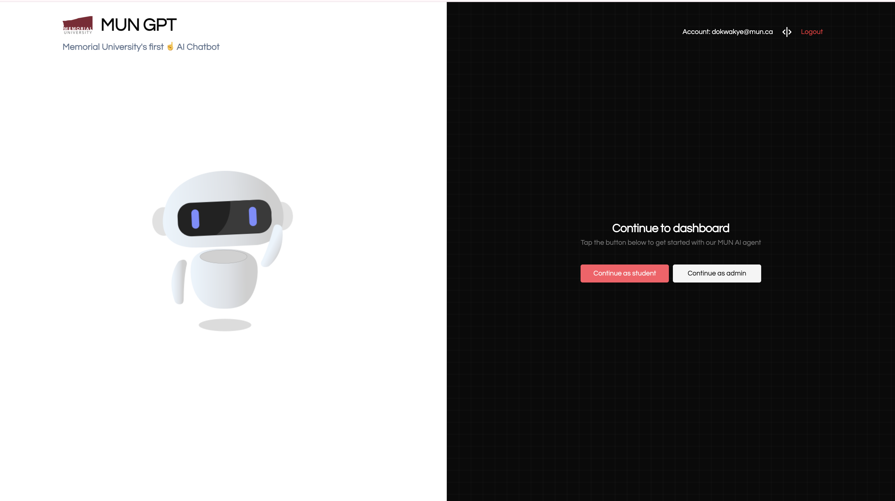
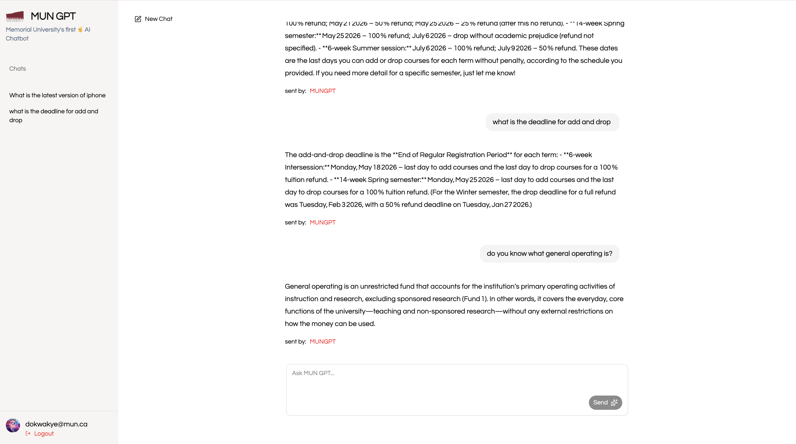
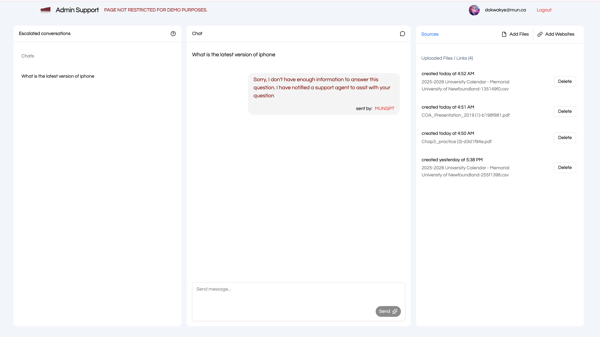

# **AI-Powered Customer Support Chatbot**

An intelligent 24/7 virtual assistant designed for Memorial University of Newfoundland.
It answers FAQs, guides students through admissions and registration, and streamlines support services—improving accessibility, reducing wait times, and enhancing student experience.

---





---

## **Key Features**

* **AI-Driven Support** – Provides instant responses to common student questions.
* **Admissions & Registration Guidance** – Offers step-by-step help for new and returning students.
* **Campus Services Assistance** – Directs users to housing, fees, academic advising, and other services.
* **24/7 Availability** – Ensures support at any time without human delays.
* **Next.js Frontend** – Modern, fast UI with real-time interactions.
* **Expandable Architecture** – Easily integrate more features, APIs, or university datasets.

---

## **Setup Instructions**

### **1. Clone the Repository**

```bash
git clone https://github.com/your-username/AI-Powered-Customer-Support-Chatbot.git
cd AI-Powered-Customer-Support-Chatbot
```

### **2. Install Dependencies**

Choose your package manager:

```bash
npm install
# or
yarn install
# or
pnpm install
# or
bun install
```

### **3. Configure Environment Variables**

Create a `.env.local` file in the project root:

```
AUTH0_SECRET='XXX-XXXX'
APP_BASE_URL='http://localhost:3000'
AUTH0_DOMAIN=''XXX-XXXX'
AUTH0_CLIENT_ID='XXX-XXXX'
AUTH0_CLIENT_SECRET=''XXX-XXXX'
# 'If your application is API authorized add the variables AUTH0_AUDIENCE and AUTH0_SCOPE'
AUTH0_AUDIENCE='XXX-XXXX'
AUTH0_SCOPE='XXX-XXXX'

NEXT_PUBLIC_API_BASE_URL=http://127.0.0.1:8000

MONGO_DB_USERNAME='XXX-XXXX'
MONGO_DB_PASSWORD='XXX-XXXX'
MONGO_DB_CONNECTION='XXX-XXXX'
```

### **4. Run the Development Server**

```bash
npm run dev
# or
yarn dev
# or
pnpm dev
# or
bun dev
```

Open **[http://localhost:3000](http://localhost:3000)** to view the app in your browser.

---

## **Usage**

Once the server is running:

* The chatbot interface loads from the chatbot widget on the homepage.
* Users can login as student or Admin
* Users can type questions related to financial services and fees.
* The chatbot generates accurate and helpful responses in real time.
* Admin can upload useful documents and links to train the AI.
* Admin handles escalated queries.

---

## **Technologies Used**

* **Next.js 14 (App Router)**
* **TypeScript**
* **next/font & Geist Font**

---

## **Deployment**

Deploy easily using **CI/CD** to our custom server:


More details:
[https://mungpt-capstone.web.app/](https://mungpt-capstone.web.app/)

